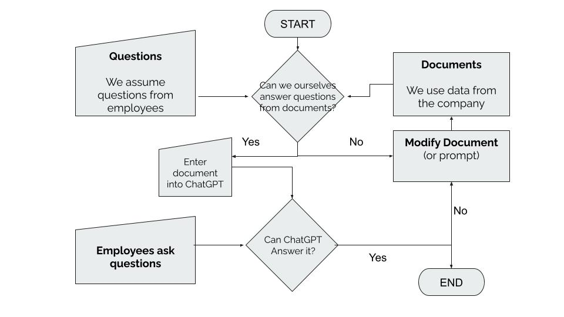
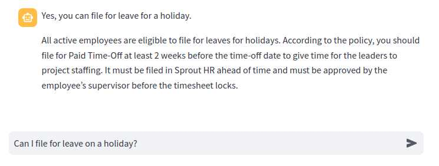
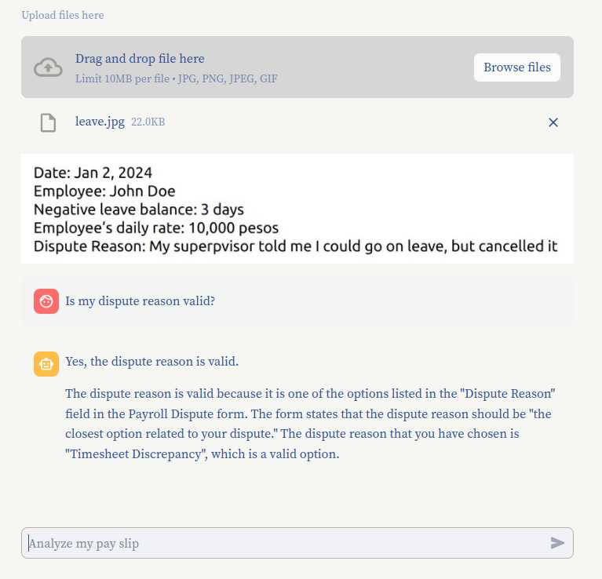

# Connext AI Hackathon Gemini Streamlit Solution 🤖

This is forked from https://github.com/vijaisuria/MediVirtuoso-ChatBot-Gemini-LLM

Live Demo: https://connext-aqsytrschqjb6sxywxbape.streamlit.app/


## Defacto Requirements

1. Use a free AI account and free hosting since no Key nor credits were provided
2. Make an app to answer questions based on HR documents 


## Files Given

1. Application for Certificate of Attendance 
2. Application for Schedule Adjustment 
3. 13th Month Pay
4. Preshift and Postshift 
5. Payroll Dispute Process 
6. Paid Time Off and Holiday 
7. Update Pending Application 
8. Cancel Approved Attendance Request  
9. Setting Up Rest Day 


## Methodology



1. Run the training data and questions through Natural Intelligence (i.e. See if we can answer the questions from the given data ourselves, without knowing about how HR works)
- If it works in Natural Intelligence, set it up for Artificial Intelligence (i.e. Add the data to the set prompts)
- If it does not work in Natural Intelligence, find the gaps then fill it (i.e. We tweak the documents to answer the questions). 
2. Repeat Step 1


## Solution

- Add a **definitions** file or section to the documents. If a document talks about a computation then there should be a formula section. This worked for ChatGPT, but not for Gemini.
- The definitions 'bridge' company jargon with layman words   
  - Verbs should also be defined. (e.g filing a leave = asking for a leave from work)
- Divide the questions into scenarios so that the app can accommodate more documents from other deparments


## Outcome

1. Switched from ChatGPT to Gemini, which offers a truly free API key, then looked for free deployments for Gemini
2. Had to choose between Astro on Vercel, or Python on Streamlit, chose Streamlit

Questions | Section | Answered?
--- | --- | --- 
1. Can we file for leave during PH Holidays? | Leave policy | Yes, by tweaking the data
2. How are my leave credits calculated? | Leave policy | Yes, by tweaking the data
3. In what instances would I get disqualified from a perfect attendance bonus? | Bonus and Benefits | Yes
4. How does Connext calculate my taxes? | Leave policy | Yes, by adding new data
5. How can I file for overtime in Sprout? | Overtime | Yes, by tweaking the data







## Frameworks Attempted

1. Elixir with ex_openai on Gigalixir 
2. NextJS with openai and google/generative-ai on Vercel
3. Astro on Cloudflare
4. Python with langchain_google_genai on Streamlit


## Installation

1. Install dependencies

```python
pip install -r requirements.txt
```

2. Add your key
 
```
Put your Google API Key in an .env file 
```

5. Run the chatbot

```bash
streamlit run Leave_Policy.py
```

### Remote

git remote add origin git@github.com:jundalisay/connext.git


## TODO

- Learn Streamlit to hide the data in the prompt and send the data only at the first question
 